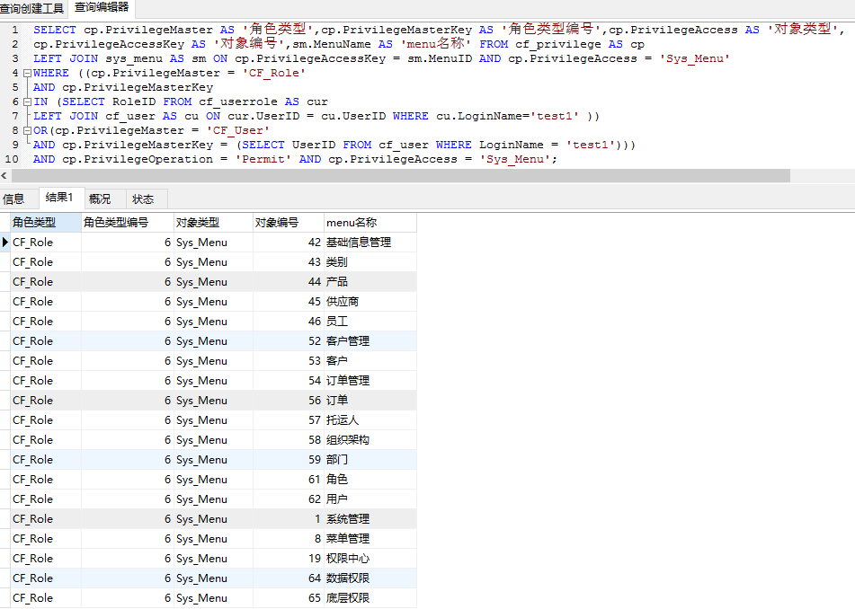
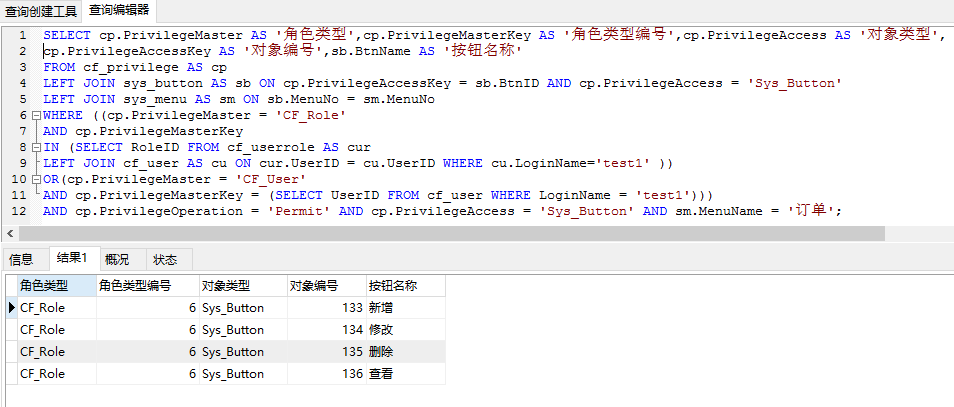

### 查询用户test1的页面权限
SELECT 	cp.PrivilegeMaster AS '角色类型',cp.PrivilegeMasterKey AS '角色类型编号', cp.PrivilegeAccess AS '对象类型',  cp.PrivilegeAccessKey AS '对象编号',sm.MenuName AS '菜单名称'  
FROM cf_privilege AS cp   
LEFT JOIN sys_menu AS sm ON cp.PrivilegeAccessKey = sm.MenuID AND cp.PrivilegeAccess = 'Sys_Menu'   
WHERE ((cp.PrivilegeMaster = 'CF_Role' AND cp.PrivilegeMasterKey   
IN (SELECT RoleID FROM cf_userrole AS cur   
LEFT JOIN cf_user AS cu ON cur.UserID = cu.UserID  WHERE cu.LoginName='test1' )) 
OR (cp.PrivilegeMaster = 'CF_User'   
AND cp.PrivilegeMasterKey = (SELECT UserID FROM cf_user WHERE LoginName = 'test1')))  
AND cp.PrivilegeOperation = 'Permit' AND cp.PrivilegeAccess = 'Sys_Menu';

### 查询结果如图:

### 伪代码:
1、根据名称查找人员编号UserID  
2、根据人员编号UserID查找改人员所对应的角色集合RoleIDs  
3、权限表&emsp;LEFT JOIN&emsp;页面表并查找  
&emsp;&emsp;&emsp;角色类型为CF_Role &emsp; AND &emsp; 角色编号在角色集合RoleIDs中  
&emsp;&emsp;OR  
&emsp;&emsp;&emsp;角色类型为CF_User &emsp; AND &emsp; 人员编号为UserID  
&emsp;&emsp;AND 权限属性为Permit &emsp; AND &emsp; 权限为Sys_Menu的数据

### 对订单(order)页面中的操作权限(sys_button)  
SELECT 	cp.PrivilegeMaster AS '角色类型',cp.PrivilegeMasterKey AS '角色类型编号',cp.PrivilegeAccess AS '对象类型',cp.PrivilegeAccessKey AS '对象编号',sb.BtnName AS '按钮名称'  
FROM cf_privilege AS cp   
LEFT JOIN sys_button AS sb ON cp.PrivilegeAccessKey = sb.BtnID AND cp.PrivilegeAccess = 'Sys_Button'  
LEFT JOIN sys_menu AS sm ON sb.MenuNo = sm.MenuNo   
WHERE ((cp.PrivilegeMaster = 'CF_Role'   
AND cp.PrivilegeMasterKey IN (SELECT RoleID FROM cf_userrole AS cur   
LEFT JOIN cf_user AS cu ON cur.UserID = cu.UserID  WHERE cu.LoginName='test1' ))   
OR (cp.PrivilegeMaster = 'CF_User' AND cp.PrivilegeMasterKey = (SELECT UserID FROM cf_user WHERE LoginName = 'test1')))  
AND cp.PrivilegeOperation = 'Permit' AND cp.PrivilegeAccess = 'Sys_Button' AND sm.MenuName = '订单';  
### 查询结果如图

### 伪代码
1、根据名称查找人员编号UserID  
2、根据人员编号UserID查找改人员所对应的角色集合RoleIDs  
3、权限表&emsp;LEFT JOIN&emsp;按钮表&emsp;LEFT JOIN&emsp;页面表并查找  
&emsp;&emsp;&emsp;角色类型为CF_Role &emsp; AND &emsp; 角色编号在角色集合RoleIDs中  
&emsp;&emsp;OR  
&emsp;&emsp;&emsp;角色类型为CF_User &emsp; AND &emsp; 人员编号为UserID  
&emsp;&emsp;AND 权限属性为Permit &emsp; AND &emsp; 权限为Sys_Button&emsp;AND&emsp;菜单名字为订单的数据
